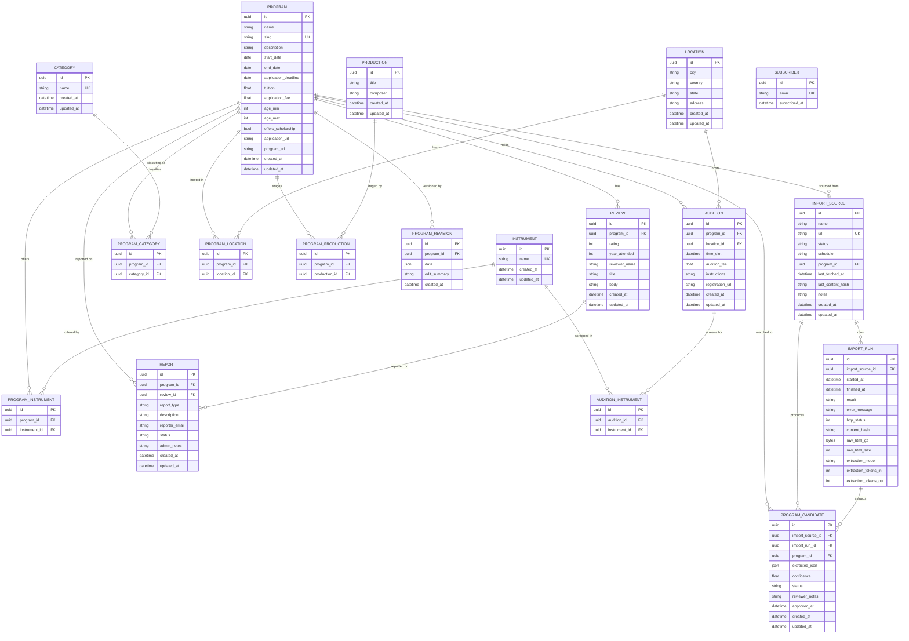

# Young Artist Community

A free, community-built directory of young artist programs in classical music and opera. Browse summer festivals, academies, and YAPs with honest reviews from past participants.

**Live at [youngartist.community](https://youngartist.community)**

## What this is

Young Artist Community is a directory and review platform for classical music training programs. Singers and instrumentalists can:

- **Browse and filter** programs by instrument, category, country, tuition, and more
- **Read and write reviews** from people who have actually attended
- **Submit new programs** to grow the directory
- **Compare programs** side-by-side on cost, deadlines, and community ratings

The platform is free to use, has no ads, no paid placements, and no paywalls. Content is contributed by the community and curated with a lightweight admin pipeline.

## Stack

| Layer          | Technology                                                    |
| -------------- | ------------------------------------------------------------- |
| Framework      | Next.js 16 (App Router, Server Components)                    |
| Language       | TypeScript (strict mode)                                      |
| Database       | Postgres — **Supabase** (production) + **Neon** (preview/dev) |
| ORM            | Prisma 7 with `@prisma/adapter-pg`                            |
| Styling        | Tailwind CSS v4                                               |
| LLM extraction | OpenRouter (Claude Haiku 4.5)                                 |
| CI/CD          | GitHub Actions + Vercel                                       |
| Hosting        | Vercel                                                        |

## Project structure

```
src/
  app/
    page.tsx                  # landing page
    programs/
      page.tsx                # browsable/filterable directory
      [slug]/page.tsx         # program detail + reviews
      new/                    # public program submission
    reviews/new/              # standalone review form
    admin/                    # admin panel (token-gated)
      import/                 # import pipeline review queue
      data/                   # program/review/audition CRUD
    api/                      # REST API (read public, write admin-gated)
  lib/
    prisma.ts                 # Prisma client singleton (verified TLS)
    auth.ts                   # requireAdmin() guard for API routes
    admin-auth.ts             # timing-safe ADMIN_TOKEN cookie check
    rate-limit.ts             # in-memory IP rate limiter
    import/                   # scrape + LLM extraction pipeline
prisma/
  schema.prisma               # database schema
  migrations/                 # versioned SQL migrations (prisma migrate)
  seed.ts                     # reference data seeding
scripts/
  sync-prod-to-neon.sh        # daily Supabase→Neon dump + PII scrub
.github/workflows/
  ci.yml                      # lint/typecheck/test + Playwright e2e
  sync-prod-to-neon.yml       # daily 04:00 UTC, manual dispatch
```

## Data model



## Getting started

### Prerequisites

- Node.js 24+
- A Postgres database. The deployed app uses Supabase (prod) and Neon (preview/dev). For local dev, any Postgres 17 works — we recommend a Neon dev branch.

### Setup

```bash
# Clone and install
git clone https://github.com/mojoro/young-artist-community.git
cd young-artist-community
npm install

# Configure environment
cp .env.example .env.local
# Edit .env.local — set DATABASE_URL (and DATABASE_URL_UNPOOLED for migrations),
# ADMIN_TOKEN, OPENROUTER_API_KEY, CRON_SECRET.

# Set up database
npx prisma generate
npx prisma migrate deploy   # applies all migrations from prisma/migrations/
npx prisma db seed          # optional: seed reference data + a few programs

# Run dev server
npm run dev
```

### Database workflow

- Every schema change ships as a migration: edit `prisma/schema.prisma`, run `npm run db:migrate`, commit the generated SQL file.
- `npm run build` runs `prisma migrate deploy` (non-destructive). `prisma db push` is intentionally not exposed via npm scripts.
- The Vercel build connects to **Supabase** for Production deployments and **Neon** for Preview/Development (env-scoped). A daily GitHub Action (`sync-prod-to-neon.yml`) overwrites Neon main with a PII-scrubbed dump of Supabase prod, so previews mirror real prod state.

### Environment variables

| Variable                                 | Purpose                                                             |
| ---------------------------------------- | ------------------------------------------------------------------- |
| `POSTGRES_PRISMA_URL`                    | Supabase pooler connection (Production)                             |
| `POSTGRES_URL_NON_POOLING`               | Supabase direct connection (Production, used by `prisma migrate`)   |
| `DATABASE_URL` / `DATABASE_URL_UNPOOLED` | Neon connection (Preview + Development)                             |
| `ADMIN_TOKEN`                            | Shared secret for admin panel access                                |
| `OPENROUTER_API_KEY`                     | LLM extraction (import pipeline)                                    |
| `CRON_SECRET`                            | Vercel cron authentication                                          |
| `PG_SSL_NO_VERIFY`                       | Set `true` to skip TLS cert verification (dev only — never in prod) |

### CI/CD

- **CI** (`ci.yml`) runs on every PR: ESLint, Prettier, `tsc --noEmit`, Vitest, `npm audit`. On PR open, polls GitHub for the matching Vercel preview, then runs Playwright against the preview URL using `VERCEL_AUTOMATION_BYPASS_SECRET`.
- **Sync** (`sync-prod-to-neon.yml`) runs daily at 04:00 UTC and on demand: `pg_dump` from Supabase (public schema only), `pg_restore --clean` to Neon, then anonymizes `subscriber.email`, `feedback.email`, `report.reporter_email`. Required GH secrets: `SUPABASE_PROD_URL` (Session pooler URL), `NEON_DEV_URL` (Neon main branch unpooled URL).

## Import pipeline

The platform includes an automated import pipeline for discovering and adding programs:

1. **ImportSource** defines a URL to scrape
2. **ImportRun** fetches HTML, respects robots.txt and per-host throttling
3. **LLM extraction** (Claude Haiku via OpenRouter) parses program data from HTML
4. **ProgramCandidate** holds extracted data for human review
5. Admin approves/rejects candidates; approved ones become full Program entries

A Vercel cron job triggers the pipeline monthly. Admins can also trigger manual scrapes and re-extraction from the admin panel.

## API

The REST API follows [Zalando RESTful API Guidelines](https://opensource.zalando.com/restful-api-guidelines/) pragmatically:

- `snake_case` JSON properties and query parameters
- `application/problem+json` error responses (RFC 9457)
- Cursor-based pagination with opaque base64url tokens
- OpenAPI 3.0.3 spec in `openapi.yaml`

## Contributing

This project grows through community contributions. You can help by:

- **Writing reviews** of programs you have attended
- **Submitting programs** that are missing from the directory
- **Reporting bugs** or suggesting features via GitHub issues
- **Contributing code** via pull requests

## License

[AGPL-3.0](LICENSE) — the same license [Lichess](https://lichess.org) uses.

The code is open. You can read it, learn from it, contribute to it, and run it locally for personal use. What you cannot do is take this code and host your own competing version of the site. If you run a modified version as a public service, the AGPL requires you to open-source all of your changes — which means you can't just clone it, slap your name on it, and call it yours.

## Contact

Built by [John Moorman](https://johnmoorman.com)

- Email: john@johnmoorman.com
- LinkedIn: [john-moorman](https://www.linkedin.com/in/john-moorman/)
